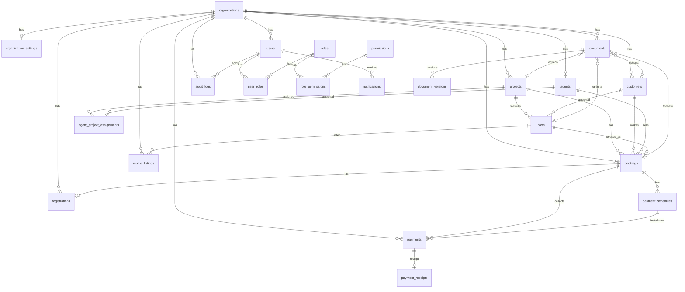
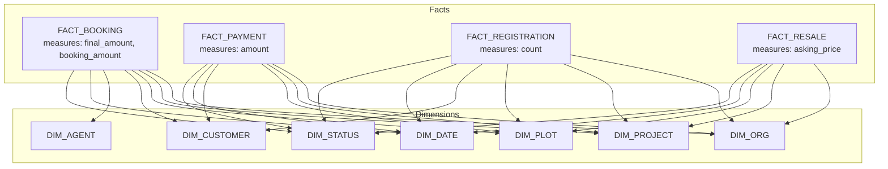

# Bhairava schema — admin modules, tables & fact/dimension model

Source of truth: `prisma/schema.prisma` (PostgreSQL).  
This doc maps **admin screens → tables**, lists **primary keys / foreign keys**, and shows a **fact / dimension** view for reporting.

---

## 1. Admin page → tables

| Admin route | Primary tables | Related / supporting |
|-------------|----------------|----------------------|
| `/admin/projects` | `projects` | `plots`, `project_blocks`, `project_phases` |
| `/admin/plots` | `plots` | `projects`, `customers`, `agents`, `bookings` |
| `/admin/customers` | `customers` | `plots`, `bookings`, `documents`, `plot_interests`, `registrations` |
| `/admin/agents` | `agents` | `agent_project_assignments`, `projects`, `bookings` |
| `/admin/bookings` | `bookings` | `plots`, `projects`, `customers`, `agents`, `payment_schedules`, `payments` |
| `/admin/payments` | `payments` | `bookings`, `payment_schedules`, `payment_receipts` |
| `/admin/documents` | `documents` | `document_versions`, optional FKs to project/plot/customer/booking |
| `/admin/registrations` | `registrations` | `bookings`, `plots`, `projects`, `customers` |
| `/admin/resale` | `resale_listings` | `plots`, `projects` |
| `/admin/reports` | *(aggregates)* | `projects`, `plots`, `bookings`, `payments`, `registrations`, `resale_listings`, `customers`, `agents` |
| `/admin/users` | `users` | `user_roles`, `roles`, `role_permissions`, `permissions` |
| `/admin/settings` | `organizations`, `organization_settings` | — |
| `/admin/audit-logs` | `audit_logs` | `users` (actor) |
| `/admin/notifications` | `notifications` | `users` |
| `/admin/dashboard` | *(aggregates)* | same as reports + recent bookings |

**Tenant scope:** almost every business row is filtered by `organization_id`.

---

## 2. Table catalogue (DB names)

Prisma model → SQL table (`@@map`).

### Core / org

| Table | PK | Important FKs / notes |
|-------|----|------------------------|
| `organizations` | `id` | Tenant root |
| `organization_settings` | `id` | `organization_id` **unique** (1:1) |
| `users` | `id` | `organization_id`; unique email/mobile per org |
| `roles` | `id` | `organization_id?` |
| `permissions` | `id` | `code` unique |
| `role_permissions` | `id` | `role_id`, `permission_id` |
| `user_roles` | `id` | `user_id`, `role_id` |
| `user_project_assignments` | `id` | `organization_id`, `user_id`, `project_id` |
| `audit_logs` | `id` | `organization_id?`, `actor_user_id?` |
| `notifications` | `id` | `organization_id`, `user_id` |
| `refresh_tokens` | `id` | `user_id` |
| `password_reset_tokens` | `id` | `user_id` |
| `login_attempts` | `id` | auth security |

### Inventory dimensions

| Table | PK | Important FKs / notes |
|-------|----|------------------------|
| `projects` | `id` | `organization_id`; unique `(organization_id, code)` |
| `project_phases` | `id` | `organization_id`, `project_id` |
| `project_blocks` | `id` | `organization_id`, `project_id` |
| `plots` | `id` | `organization_id`, `project_id`, `block_id?`, `assigned_customer_id?`, `assigned_agent_id?`; unique `(project_id, plot_number)` |
| `layout_maps` / `layout_plot_shapes` | `id` | layout geometry (optional UI) |

### People dimensions

| Table | PK | Important FKs / notes |
|-------|----|------------------------|
| `customers` | `id` | `organization_id`; unique mobile per org; JSON `follow_ups`, `document_checklist` |
| `agents` | `id` | `organization_id`, optional `user_id`; unique mobile per org |
| `agent_project_assignments` | `id` | `agent_id`, `project_id` unique pair |

### Transaction facts

| Table | PK | Important FKs / notes |
|-------|----|------------------------|
| `bookings` | `id` | `organization_id`, `project_id`, `plot_id`, `customer_id`, `agent_id?`; unique booking number per org |
| `booking_status_history` | `id` | `booking_id` |
| `payment_schedules` | `id` | `organization_id`, `booking_id` |
| `payments` | `id` | `organization_id`, `booking_id`, `schedule_id?` |
| `payment_receipts` | `id` | `payment_id`; unique receipt number per org |
| `registrations` | `id` | **1:1** `booking_id` unique; also `project_id`, `plot_id`, `customer_id` |
| `resale_listings` | `id` | `organization_id`, `project_id`, `plot_id` |
| `documents` | `id` | polymorphic `entity_type` + `entity_id`; optional typed FKs |
| `document_versions` | `id` | `document_id` + `version_number` unique |
| `plot_interests` | `id` | interest/callback from app; links plot + optional customer |
| `plot_status_history` | `id` | `plot_id` status changes |

---

## 3. ER overview (relational)

---

## 4. Fact & dimension model (analytics view)

Operational DB is normalized. For **Reports / Dashboard**, think in a **star (multi-fact)** model:

### Dimensions (who / what / where / when)

| Dimension | Grain | Source table(s) | Typical attributes |
|-----------|-------|-----------------|--------------------|
| **Dim Organization** | 1 org | `organizations`, `organization_settings` | name, code, city, brand color |
| **Dim Project** | 1 project | `projects` | name, code, city, state, status |
| **Dim Plot** | 1 plot | `plots` (+ block/phase) | plot_number, area, facing, status, price |
| **Dim Customer** | 1 customer | `customers` | name, mobile, city, kyc_status |
| **Dim Agent** | 1 agent | `agents` | name, mobile, employee_code, is_active |
| **Dim User** | 1 user | `users` + roles | name, email, status, role codes |
| **Dim Date** | 1 calendar day | *(derived)* | day, month, year, fiscal period |
| **Dim Status** | enum value | booking/plot/payment/registration/resale enums | status code, label, funnel stage |

### Facts (measurable events)

| Fact | Grain (one row =) | Measures | Dimension keys |
|------|-------------------|----------|----------------|
| **Fact Booking** | 1 booking | `booking_amount`, `final_amount`, `discount`, count=1 | org, project, plot, customer, agent, booking_date, booking_status |
| **Fact Payment** | 1 payment | `amount`, count=1 | org, booking→(project, plot, customer), payment_date, payment_status, method |
| **Fact Schedule due** | 1 installment row | `amount_due`, `balance` | org, booking, due_date, schedule_status |
| **Fact Registration** | 1 registration | count=1, days_to_complete | org, booking, project, plot, customer, status, scheduled/completed dates |
| **Fact Resale** | 1 listing | `asking_price`, count=1 | org, project, plot, listed_at, resale_status |
| **Fact Inventory snapshot** | 1 plot (as-of day) | count by status, `total_price` | org, project, plot, plot_status, as_of_date |
| **Fact Interest** | 1 plot_interest | count=1 | org, plot, customer?, interest_type, created_at |
| **Fact Audit** | 1 audit_log | count=1 | org, actor_user, action, entity, created_at |

### Star diagram (primary sales fact)

### How Reports uses this today

| Report card / section | Fact | Dimensions sliced |
|-----------------------|------|-------------------|
| Projects count | inventory / project dim | org |
| Plots + inventory bars | plot snapshot | org, plot_status |
| Bookings / in progress / sold | booking | org, booking_status |
| Collections (month / all-time) | payment | org, payment_date, status=PAID |
| Registrations & resale breakdown | registration + resale | org, status |
| Customers / agents | dimension counts | org |

---

## 5. Key relationship rules

1. **Org isolation** — queries always include `organization_id` (= session `orgId`).
2. **Booking is the sales spine** — links plot + customer (+ optional agent); payments and registration hang off booking.
3. **Registration is 1:1 with booking** — `registrations.booking_id` unique.
4. **Plot status vs booking status** — both exist; UI funnel often derives “furthest” stage from plots + bookings + interests.
5. **Documents are polymorphic** — `entity_type` + `entity_id`, with optional denormalized FKs for fast filters.
6. **Soft delete** — many tables use `deleted_at` (filter `deleted_at IS NULL` in admin lists).
7. **Resale** — `plots.status = RESALE_AVAILABLE` and/or `plots.resale_status`; commercial listing rows live in `resale_listings`.

---

## 6. Enum quick reference

| Domain | Enum | Values (high level) |
|--------|------|---------------------|
| Plot | `PlotStatus` | AVAILABLE → RESERVED → BOOKED → UNDER_DOCUMENTATION → SOLD → REGISTERED; also RESALE_AVAILABLE, BLOCKED, CANCELLED |
| Booking | `BookingStatus` | DRAFT → RESERVED → BOOKED → AGREEMENT → PENDING_DOCS → UNDER_DOCUMENTATION → SOLD → REGISTERED / CANCELLED |
| Payment | `PaymentStatus` | PENDING, PARTIAL, PAID, OVERDUE, WAIVED, CANCELLED |
| Registration | `RegistrationStatus` | NOT_STARTED, IN_PROGRESS, SCHEDULED, COMPLETED, ON_HOLD, CANCELLED |
| Resale | `ResaleStatus` | LISTED, UNDER_OFFER, SOLD, WITHDRAWN |
| User | `UserStatus` | ACTIVE, SUSPENDED |
| Project | `ProjectStatus` | DRAFT, ACTIVE, ON_HOLD, COMPLETED, CANCELLED |

---

## 7. File pointers

| Artifact | Path |
|----------|------|
| Prisma schema | `prisma/schema.prisma` |
| DB client | `src/lib/db.ts` |
| Audit writer | `src/lib/audit.ts` |
| Customer funnel (derived status) | `src/lib/customer-funnel.ts` |
| This doc | `docs/schema-facts-dimensions.md` |
